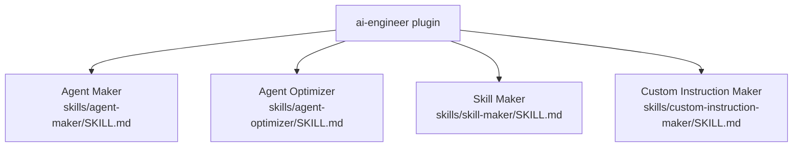

# AI Engineer `v1.0.1`

> A collection of skills for creating and optimizing VS Code agents, skills, and custom AI instruction files.

## Prerequisites

- [VS Code](https://code.visualstudio.com/) with the [GitHub Copilot Chat](https://marketplace.visualstudio.com/items?itemName=GitHub.copilot-chat) extension installed and active.

## Installation

Install via the VS Code Chat Plugin Marketplace using the `dimpletz/prompts-collection` marketplace source and enable the **ai-engineer** plugin.

## Usage

All capabilities are provided as **skills** — invoke them by describing your intent in Copilot Chat. Copilot will automatically select the appropriate skill when the request matches.

| Skill | Invoke when… |
|-------|--------------|
| **Agent Maker** | You want to create a new `.agent.md` file for a custom VS Code agent. |
| **Agent Optimizer** | You want to improve, refactor, or decompose an existing `.agent.md` into an orchestrator + subagent architecture. |
| **Skill Maker** | You want to design a new `SKILL.md` file for an AI skill in a consistent, production-ready way. |
| **Custom Instruction Maker** | You want to create an `AGENTS.md`, `copilot-instructions.md`, or `CLAUDE.md` instruction file that follows the Purpose → Tree → Rules structure. |

## Components

### Agent Maker

Creates well-structured, production-ready VS Code agent files (`.agent.md`) with required frontmatter fields and mandatory body sections. Enforces consistent structure while allowing domain-specific flexibility.

### Agent Optimizer

Analyzes and improves existing VS Code agent files. Covers quality analysis, guardrail strengthening, workflow optimization, and decomposing monolithic agents into orchestrator + subagent architectures.

### Skill Maker

A meta-skill for designing new `SKILL.md` files. Clarifies purpose, inputs, priorities, and workflow so that downstream assistants behave predictably and are easy to maintain.

### Custom Instruction Maker

Creates structured AI instruction files (`AGENTS.md`, `copilot-instructions.md`, `CLAUDE.md`) following the Purpose → Tree → Rules structure with a built-in self-improving note-taking engine.

## Author

[Dimpletz](https://github.com/dimpletz)
