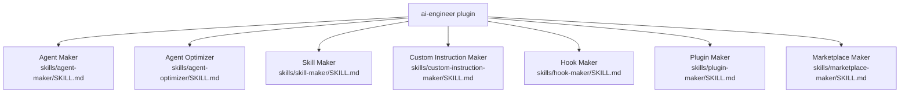

# AI Engineer `v1.2.0`

> A collection of skills for creating and optimizing VS Code agents, skills, hooks, plugins, and custom AI instruction files.

## Prerequisites

- [VS Code](https://code.visualstudio.com/) with the [GitHub Copilot Chat](https://marketplace.visualstudio.com/items?itemName=GitHub.copilot-chat) extension installed and active.

## Installation

Install via the VS Code Chat Plugin Marketplace using the `dimpletz/prompts-collection` marketplace source and enable the **ai-engineer** plugin.

## Usage

All capabilities are provided as **skills** — invoke them by describing your intent in Copilot Chat. Copilot will automatically select the appropriate skill when the request matches.

| Skill | Invoke when… |
|-------|--------------|
| **Agent Maker** | You want to create a new `.agent.md` file for a custom VS Code agent, either at workspace level (`.github/agents/`) or inside a specific plugin directory. |
| **Agent Optimizer** | You want to improve, refactor, or decompose an existing `.agent.md` into an orchestrator + subagent architecture. |
| **Skill Maker** | You want to design a new `SKILL.md` file for an AI skill, either at workspace level (`.agents/skills/`) or inside a specific plugin directory. |
| **Custom Instruction Maker** | You want to create an `AGENTS.md`, `copilot-instructions.md`, or `CLAUDE.md` instruction file that follows the Purpose → Tree → Rules structure. |
| **Hook Maker** | You want to create a lifecycle hook (`hooks.json` + scripts) that runs automatically at session start, subagent start, or after tool use. |
| **Plugin Maker** | You want to scaffold a new plugin with a `plugin.json` manifest, README, and the correct directory structure. Always uses `.claude-plugin/plugin.json` for hook-based plugins. |
| **Marketplace Maker** | You want to register or synchronize the project's plugins in the VS Code Chat Plugin Marketplace (`marketplace.json` + `README.md`). |

## Components

### Agent Maker

Creates well-structured, production-ready VS Code agent files (`.agent.md`) with required frontmatter fields and mandatory body sections. Saves to `plugins/<plugin-name>/agents/` when a plugin name is provided, or to `.github/agents/` at workspace level. Enforces consistent structure while allowing domain-specific flexibility.

### Agent Optimizer

Analyzes and improves existing VS Code agent files. Covers quality analysis, guardrail strengthening, workflow optimization, and decomposing monolithic agents into orchestrator + subagent architectures. Preserves the original file's scope — saves optimized files in the same directory as the source (plugin or workspace).

### Skill Maker

A meta-skill for designing new `SKILL.md` files. Clarifies purpose, inputs, priorities, and workflow so that downstream assistants behave predictably and are easy to maintain. Saves to `plugins/<plugin-name>/skills/<skill-name>/SKILL.md` when a plugin name is provided, or to `.agents/skills/<skill-name>/SKILL.md` at workspace level.

### Custom Instruction Maker

Creates structured AI instruction files (`AGENTS.md`, `copilot-instructions.md`, `CLAUDE.md`) following the Purpose → Tree → Rules structure with a built-in self-improving note-taking engine.

### Hook Maker

Creates VS Code Copilot agent hook configurations (`hooks.json` and companion shell/PowerShell scripts). Covers all lifecycle events (`SessionStart`, `SubagentStart`, `PostToolUse`), both context-injection and exit-code-enforcement patterns, and cross-platform script generation.

### Plugin Maker

Scaffolds a complete VS Code Copilot agent plugin: the `plugin.json` manifest (always `.claude-plugin/plugin.json` for hook-based plugins, `plugin/plugin.json` for skill/agent-only plugins), directory structure, and `README.md`. Also registers the plugin in `marketplace.json`.

### Marketplace Maker

Registers, synchronizes, and updates the project's plugins in the VS Code Chat Plugin Marketplace. Keeps `.github/plugin/marketplace.json` and the global `README.md` (Plugins table, Agents catalog, Skills catalog, Hooks table) in sync with the actual plugin contents.

## Author

[Dimpletz](https://github.com/dimpletz)
