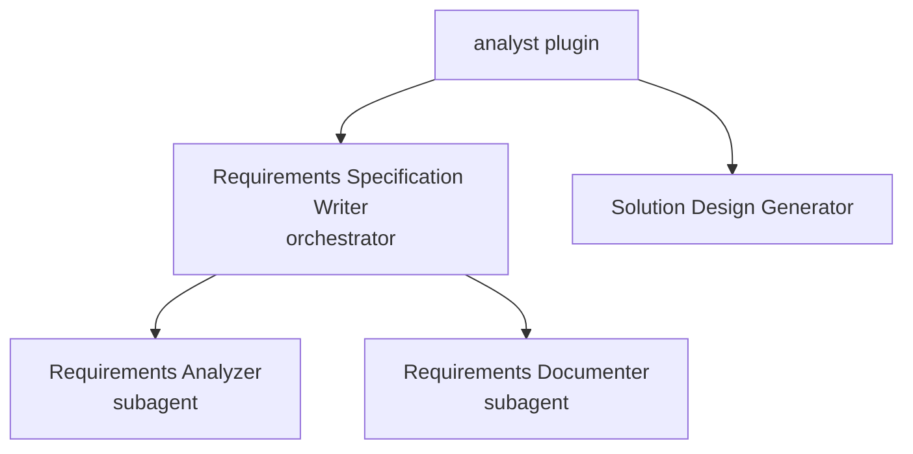

# Analyst `v1.0.0`

> A collection of agents for writing software requirements specifications and generating solution designs.

## Prerequisites

- [VS Code](https://code.visualstudio.com/) with the [GitHub Copilot Chat](https://marketplace.visualstudio.com/items?itemName=GitHub.copilot-chat) extension installed and active.

## Installation

Install via the VS Code Chat Plugin Marketplace using the `dimpletz/prompts-collection` marketplace source and enable the **analyst** plugin.

## Usage

All capabilities are provided as **agents**. Open Copilot Chat and select the desired agent from the agent picker, then describe what you need.

| Agent | Invoke when… |
|-------|--------------|
| **Requirements Specification Writer** | You want to produce comprehensive, testable software requirement specifications with user stories, acceptance criteria, and optional JIRA integration. |
| **Solution Design Generator** | You want to create a professional solution design document with architecture diagrams, data flows, and technical specifications. |

## Components

### Requirements Specification Writer

An orchestrator agent that coordinates comprehensive requirements creation. Delegates analysis to the **Requirements Analyzer** subagent and documentation to the **Requirements Documenter** subagent. Produces well-structured deliverables for developers, testers, and non-technical stakeholders.

**Outputs include:** user stories, functional requirements, acceptance criteria, database schemas, API specifications, and Mermaid architecture diagrams.

### Solution Design Generator

An expert solution design architect that creates enterprise-grade solution design documents from codebases, technical specifications, business requirements, and attachments. Produces Mermaid diagrams, clear explanations, and industry best-practice recommendations covering software architecture patterns, database design, API design, cloud architecture, and security.

## Author

[Dimpletz](https://github.com/dimpletz)
