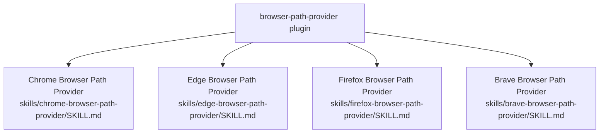

# Browser Path Provider `v1.0.0`

> Skills that return the absolute path of major browser executables (Chrome, Edge, Firefox, Brave), or notify the user if a browser is not installed.

## Prerequisites

- [VS Code](https://code.visualstudio.com/) with the [GitHub Copilot Chat](https://marketplace.visualstudio.com/items?itemName=GitHub.copilot-chat) extension installed and active.

## Installation

Install via the VS Code Chat Plugin Marketplace using the `dimpletz/prompts-collection` marketplace source and enable the **browser-path-provider** plugin.

## Usage

This plugin provides one **skill per browser** — describe a need for a browser path in Copilot Chat and the matching skill is automatically invoked.

| Skill | Invoke when… |
|-------|--------------|
| **Chrome Browser Path** | You need the absolute path of the Chrome executable on the current machine, or want to know whether Chrome is installed. |
| **Edge Browser Path** | You need the absolute path of the Microsoft Edge executable on the current machine, or want to know whether Edge is installed. |
| **Firefox Browser Path** | You need the absolute path of the Firefox executable on the current machine, or want to know whether Firefox is installed. |
| **Brave Browser Path** | You need the absolute path of the Brave executable on the current machine, or want to know whether Brave is installed. |

## Components

### Chrome Browser Path

Checks all well-known Chrome installation locations for the current OS (Windows, macOS, Linux) and returns the absolute path to the first executable found. If no installation is detected, reports that Chrome is not available and provides a download link.

**Checked locations:**

| OS | Locations checked |
|----|------------------|
| Windows | `%ProgramFiles%`, `%ProgramFiles(x86)%`, `%LocalAppData%` |
| macOS | `/Applications/Google Chrome.app/…`, `~/Applications/Google Chrome.app/…` |
| Linux | `/usr/bin/google-chrome`, `/usr/bin/google-chrome-stable`, `/usr/bin/chromium-browser`, `/usr/bin/chromium`, `/snap/bin/chromium`, `/snap/bin/google-chrome` |

### Edge Browser Path

Checks all well-known Microsoft Edge installation locations for the current OS and returns the absolute path to the first executable found. If no installation is detected, reports that Edge is not available and provides a download link.

**Checked locations:**

| OS | Locations checked |
|----|------------------|
| Windows | `%ProgramFiles(x86)%`, `%ProgramFiles%`, `%LocalAppData%` |
| macOS | `/Applications/Microsoft Edge.app/…`, `~/Applications/Microsoft Edge.app/…` |
| Linux | `/usr/bin/microsoft-edge`, `/usr/bin/microsoft-edge-stable`, `/usr/bin/microsoft-edge-beta`, `/usr/bin/microsoft-edge-dev`, `/snap/bin/microsoft-edge` |

### Firefox Browser Path

Checks all well-known Mozilla Firefox installation locations for the current OS and returns the absolute path to the first executable found. If no installation is detected, reports that Firefox is not available and provides a download link.

**Checked locations:**

| OS | Locations checked |
|----|------------------|
| Windows | `%ProgramFiles%`, `%ProgramFiles(x86)%`, `%LocalAppData%` |
| macOS | `/Applications/Firefox.app/…`, `~/Applications/Firefox.app/…` |
| Linux | `/usr/bin/firefox`, `/usr/bin/firefox-esr`, `/snap/bin/firefox`, `/usr/lib/firefox/firefox` |

### Brave Browser Path

Checks all well-known Brave installation locations for the current OS and returns the absolute path to the first executable found. If no installation is detected, reports that Brave is not available and provides a download link.

**Checked locations:**

| OS | Locations checked |
|----|------------------|
| Windows | `%ProgramFiles%`, `%ProgramFiles(x86)%`, `%LocalAppData%` |
| macOS | `/Applications/Brave Browser.app/…`, `~/Applications/Brave Browser.app/…` |
| Linux | `/usr/bin/brave-browser`, `/usr/bin/brave-browser-stable`, `/usr/bin/brave-browser-beta`, `/snap/bin/brave` |

## Author

[Dimpletz](https://github.com/dimpletz)
