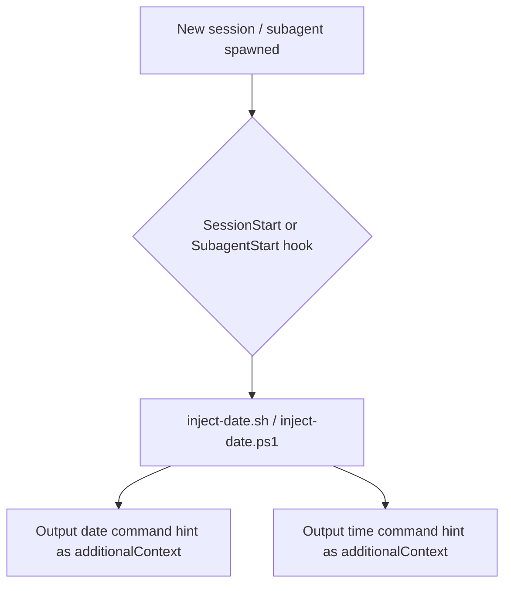

# current-date-injector `v1.3.0`

> A Claude plugin that injects instructions for how to obtain the current date and time into the agent context at the start of every session, so agents can always determine the current date and time when needed.

## Prerequisites

- **bash** (Linux/macOS) or **PowerShell** (Windows) — both are available by default on their respective platforms. No additional installation is required.

## Installation

Install via the VS Code Chat Plugin Marketplace using the `dimpletz/prompts-collection` marketplace source and enable the **current-date-injector** plugin.

## How It Works

The plugin registers `SessionStart` and `SubagentStart` hooks (`hooks/hooks.json`).

- **SessionStart** fires once when a new agent session begins and runs a single script, `inject-date`, which injects the commands the agent should run to obtain the current date and current time in 24-hr format with timezone.
- **SubagentStart** fires each time a subagent is spawned and runs the same script so every subagent also knows how to get the current date and time.

## Components



## Output Example

When triggered, the hooks surface the following context to the agent:

```
To get the current date, run: (Get-Date).ToString('MMMM d, yyyy'). If the current date does not match the output of this command, use the command output as the current date.
To get the current time in 24-hr format with timezone, run: (Get-Date).ToString('HH:mm:ss zzz')
```
