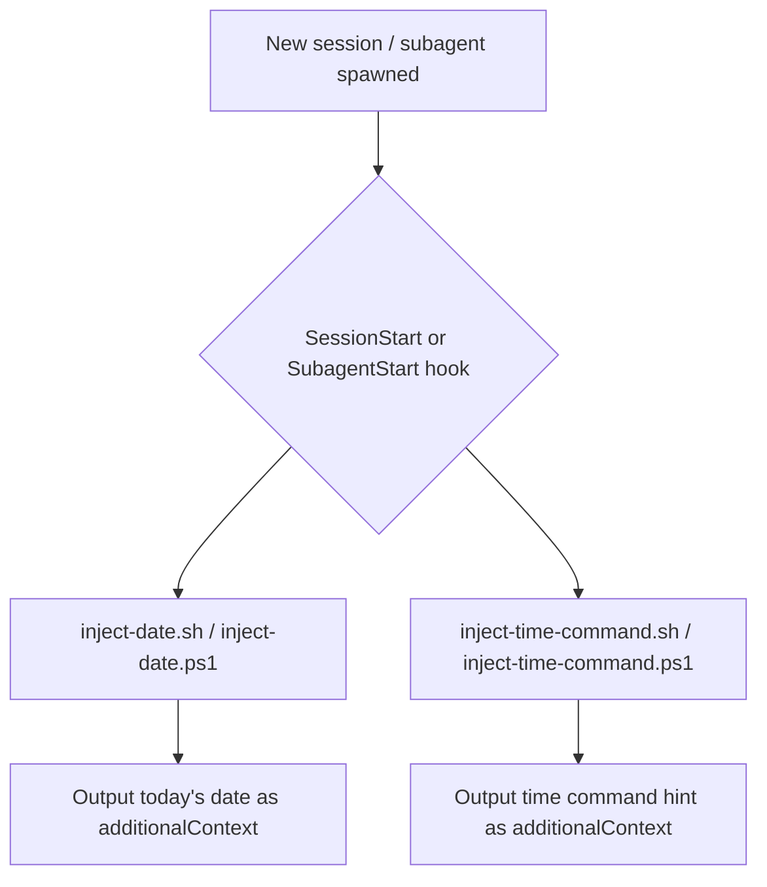

# current-date-injector `v1.2.0`

> A Claude plugin that injects the current date (YYYY-MM-DD) into the agent context at the start of every session, and provides the command to determine the current time in 24-hr format with timezone, so agents always have date and time awareness without being told.

## Prerequisites

- **bash** (Linux/macOS) or **PowerShell** (Windows) — both are available by default on their respective platforms. No additional installation is required.

## Installation

Install via the VS Code Chat Plugin Marketplace using the `dimpletz/prompts-collection` marketplace source and enable the **current-date-injector** plugin.

## How It Works

The plugin registers `SessionStart` and `SubagentStart` hooks (`hooks/hooks.json`).

- **SessionStart** fires once when a new agent session begins and runs two scripts:
  1. `inject-date` — injects today's date as `additionalContext`.
  2. `inject-time-command` — injects the command the agent should run to get the current time in 24-hr format with timezone.
- **SubagentStart** fires each time a subagent is spawned and runs the same two scripts so every subagent also knows today's date and how to get the current time.

## Components



## Output Example

When triggered, the hooks surface the following context to the agent:

```
The current date is 2026-04-19 (YYYY-MM-DD).
To get the current time in 24-hr format with timezone, run: (Get-Date).ToString('HH:mm:ss zzz')
```
