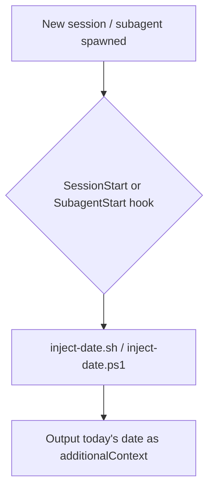

# current-date-injector `v1.0.0`

> A Claude plugin that injects the current date (YYYY-MM-DD) into the agent context at the start of every session, so agents always know today's date without being told.

## Prerequisites

- **bash** (Linux/macOS) or **PowerShell** (Windows) — both are available by default on their respective platforms. No additional installation is required.

## Installation

Install via the VS Code Chat Plugin Marketplace using the `dimpletz/prompts-collection` marketplace source and enable the **current-date-injector** plugin.

## How It Works

The plugin registers `SessionStart` and `SubagentStart` hooks (`hooks/hooks.json`). `SessionStart` fires once when a new agent session begins; `SubagentStart` fires each time a subagent is spawned. Both hooks run the same date-injection script.

When triggered, the script outputs today's date as `additionalContext` so every session and every subagent receives the current date automatically.

## Components



## Output Example

When triggered, the hook surfaces the following context to the agent:

```
Today's date is 2026-04-13 (YYYY-MM-DD).
```
