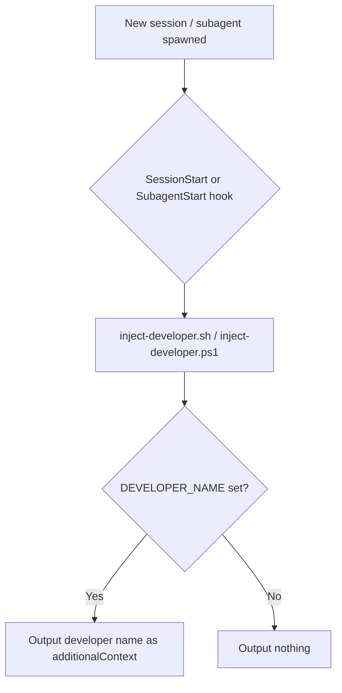

# developer-id-injector `v1.0.0`

> A Claude plugin that injects the developer name from the `DEVELOPER_NAME` environment variable into the agent context at the start of every session, so agents always know the author/developer name without being told.

## Prerequisites

- The `DEVELOPER_NAME` environment variable must be set on your machine.
- **bash** (Linux/macOS) or **PowerShell** (Windows) — both are available by default on their respective platforms. No additional installation is required.

## Installation

Install via the VS Code Chat Plugin Marketplace using the `dimpletz/prompts-collection` marketplace source and enable the **developer-id-injector** plugin.

## Configuration

Set the `DEVELOPER_NAME` environment variable to your name before starting a session:

**Windows (PowerShell):**
```powershell
$env:DEVELOPER_NAME = "Jane Smith"
```

**Linux/macOS (bash):**
```bash
export DEVELOPER_NAME="Jane Smith"
```

For a permanent setup, add the variable to your system environment variables or shell profile (`.bashrc`, `.zshrc`, etc.).

## How It Works

The plugin registers `SessionStart` and `SubagentStart` hooks (`hooks/hooks.json`). `SessionStart` fires once when a new agent session begins; `SubagentStart` fires each time a subagent is spawned. Both hooks run the same developer name injection script.

When triggered, the script reads `DEVELOPER_NAME` from the environment and outputs it as `additionalContext` so every session and every subagent receives the developer name automatically. If the variable is not set, the script outputs nothing.

## Components



## Output Example

When triggered with `DEVELOPER_NAME=Jane Smith`, the hook surfaces the following context to the agent:

```
The developer name is 'Jane Smith'. Use this as the author name or whenever a developer/programmer name is needed.
```
