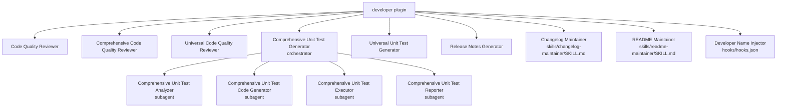

# Developer `v1.2.0`

> A collection of agents and skills for code quality reviews, unit test generation, release notes, and project file maintenance.

## Prerequisites

- [VS Code](https://code.visualstudio.com/) with the [GitHub Copilot Chat](https://marketplace.visualstudio.com/items?itemName=GitHub.copilot-chat) extension installed and active.

## Installation

Install via the VS Code Chat Plugin Marketplace using the `dimpletz/prompts-collection` marketplace source and enable the **developer** plugin.

## Usage

This plugin provides both **agents** (selected from the Copilot Chat agent picker) and **skills** (automatically invoked by Copilot when the request matches).

### Agents

| Agent | Invoke when… |
|-------|--------------|
| **Code Quality Reviewer** | You want a comprehensive code review for PHP (Magento 2, Laravel, Symfony), .NET, JavaScript/TypeScript, or Python files. |
| **Comprehensive Code Quality Reviewer** | You want an in-depth, evidence-based code quality analysis with an executive summary and Confluence-ready report. |
| **Universal Code Quality Reviewer** | You want a language-agnostic deep code review covering quality, security, performance, and scalability. |
| **Comprehensive Unit Test Generator** | You want end-to-end unit test generation: analysis, generation, execution, and HTML coverage reporting with 80%+ coverage and 100% pass rate. |
| **Universal Unit Test Generator** | You want unit tests generated for any major programming language or framework. |
| **Release Notes Generator** | You want professional release notes from Jira tickets, Confluence pages, CSV/Excel lists, or specifications. |

### Skills

| Skill | Invoke when… |
|-------|--------------|
| **Changelog Maintainer** | You need to insert a new version entry into `CHANGELOG.md` in a consistent, structured format. |
| **README Maintainer** | You need to create or update a `README.md` file. |

### Hooks

The plugin registers `SessionStart` and `SubagentStart` hooks (`hooks/hooks.json`). The hooks read up to three optional environment variables and inject any that are set as `additionalContext` so every session and every subagent knows the developer details automatically. Variables that are not set are silently skipped.

| Variable | Injected as |
|----------|-------------|
| `DEVELOPER_NAME` | Author name — used whenever a developer/programmer name is needed. |
| `DEVELOPER_EMAIL` | Developer email — used whenever a developer email is needed. |
| `DEVELOPER_COUNTRY` | Developer country — used for any country-specific context. |

**Windows (PowerShell):**
```powershell
$env:DEVELOPER_NAME    = "Jane Smith"
$env:DEVELOPER_EMAIL   = "jane@example.com"
$env:DEVELOPER_COUNTRY = "AU"
```

**Linux/macOS (bash):**
```bash
export DEVELOPER_NAME="Jane Smith"
export DEVELOPER_EMAIL="jane@example.com"
export DEVELOPER_COUNTRY="AU"
```

## Components



### Code Quality Reviewer

Expert reviewer covering Magento 2, Laravel, Symfony, .NET, JavaScript/TypeScript, Python, and more. Reviews individual files, selections, modules, or entire codebases for coding standards, security vulnerabilities, performance issues, and maintainability.

### Comprehensive Code Quality Reviewer

Performs in-depth, evidence-based analysis with executive summary, production readiness assessment, and stakeholder-ready Markdown reports. Every recommendation is backed by verified official documentation.

### Universal Code Quality Reviewer

Language-agnostic deep review covering all major programming languages and frameworks. Focuses on quality, best practices, security, performance, and scalability.

### Comprehensive Unit Test Generator

A production-ready orchestrator that coordinates four specialized subagents — **Analyzer**, **Code Generator**, **Executor**, and **Reporter** — to deliver unit tests with 80%+ coverage, full mocking, all test paths (positive/negative/edge cases), iterative fixing, and an HTML coverage report.

**Supported languages:** JavaScript/TypeScript, Python, Java, C#, PHP, Ruby, Go, Rust.

### Universal Unit Test Generator

Single-agent test generation for all major programming languages and frameworks. Supports C#/.NET, Java, PHP, Python, Go, Ruby, Rust, Kotlin, JavaScript, TypeScript, React, Vue, Angular, Swift, and more.

### Release Notes Generator

Creates comprehensive, standardized release notes from module specifications, Jira tickets, Confluence pages, or CSV/Excel lists. Targets both technical and non-technical stakeholders.

### Changelog Maintainer

Inserts new version entries at the top of `CHANGELOG.md` in a consistent format with **Added**, **Changed**, **Fixed**, and **Removed** buckets.

### README Maintainer

Creates or updates `README.md` files. Supports both greenfield creation and surgical incremental updates. Uses Mermaid diagrams for architecture overviews.

## Author

[Dimpletz](https://github.com/dimpletz)
