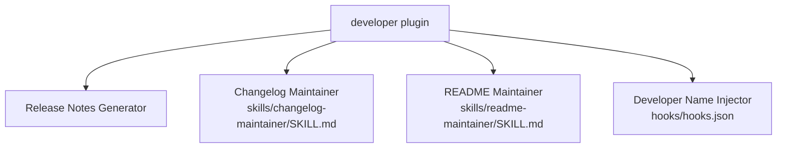

# Developer `v1.2.0`

> A collection of agents and skills for release notes generation and project file maintenance.

## Prerequisites

- [VS Code](https://code.visualstudio.com/) with the [GitHub Copilot Chat](https://marketplace.visualstudio.com/items?itemName=GitHub.copilot-chat) extension installed and active.

## Installation

Install via the VS Code Chat Plugin Marketplace using the `dimpletz/prompts-collection` marketplace source and enable the **developer** plugin.

## Components

```mermaid
graph TD
    A[developer plugin]
    A --> B[Release Notes Generator]
    A --> C[Changelog Maintainer<br/>skills/changelog-maintainer/SKILL.md]
    A --> D[README Maintainer<br/>skills/readme-maintainer/SKILL.md]
    A --> E[Developer Name Injector<br/>hooks/hooks.json]
```

### Release Notes Generator

Creates comprehensive, standardized release notes from module specifications, Jira tickets, Confluence pages, or CSV/Excel lists. Targets both technical and non-technical stakeholders.

### Changelog Maintainer

Inserts new version entries at the top of `CHANGELOG.md` in a consistent format with **Added**, **Changed**, **Fixed**, and **Removed** buckets.

### README Maintainer

Creates or updates `README.md` files. Supports both greenfield creation and surgical incremental updates. Uses Mermaid diagrams for architecture overviews.

## Author

[Dimpletz](https://github.com/dimpletz)
