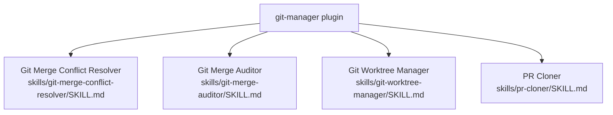

# Git Manager `v1.1.1`

> A collection of skills for managing Git repositories, worktrees, merge conflicts, and pull requests.

## Prerequisites

- [VS Code](https://code.visualstudio.com/) with the [GitHub Copilot Chat](https://marketplace.visualstudio.com/items?itemName=GitHub.copilot-chat) extension installed and active.
- Git installed and available on the system `PATH`.

## Installation

Install via the VS Code Chat Plugin Marketplace using the `dimpletz/prompts-collection` marketplace source and enable the **git-manager** plugin.

## Usage

All capabilities are provided as **skills** — describe your git task in Copilot Chat and the appropriate skill is automatically invoked.

| Skill | Invoke when… |
|-------|--------------|
| **Git Merge Conflict Resolver** | You encounter merge conflicts (e.g. "error: Merging is not possible because you have unmerged files."). |
| **Git Merge Auditor** | You want to verify that a target branch contains all commits and changes from a source branch. |
| **Git Worktree Manager** | You want to create, list, move, remove, or purge a Git worktree. |
| **PR Cloner** | You want to fetch a pull request locally to inspect or test it without merging. |

## Components

### Git Merge Conflict Resolver

A structured workflow for resolving git merge conflicts. Guides through aborting a broken merge state, identifying conflicting files, resolving them, and completing the merge cleanly. Use this skill **only when a merge conflict is already present** — not for preventing conflicts before they occur.

### Git Merge Auditor

Audits whether a target branch fully contains all commits and changes from a source branch. Detects missing commits, unmerged file changes, and divergent history segments. Use this skill to verify merges, rebases, and cherry-picks — **not** to perform them.

### Git Worktree Manager

Manages the full lifecycle of Git worktrees: **Create**, **List**, **Move/Lock/Unlock**, and **Remove/Purge**. All worktrees are placed beside the repository root and follow the naming convention `<REPO>-worktree-<BRANCH>`.

### PR Cloner

Fetches a pull request from a remote Git repository into a local tracking branch for inspection, review, or testing. Supports GitHub/GitLab-style remotes and Bitbucket remotes. Does **not** merge the PR.

## Author

[Dimpletz](https://github.com/dimpletz)
