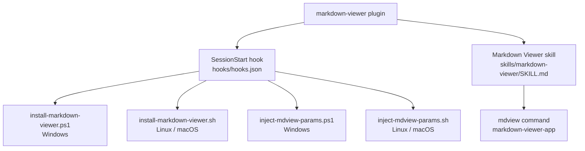

# Markdown Viewer `v1.1.0`

> A plugin that installs [markdown-viewer-app](https://github.com/dimpletz/markdown-viewer) automatically via pip and provides a skill to open any markdown file in a full browser UI using the `mdview` command.

## Prerequisites

- [VS Code](https://code.visualstudio.com/) with the [GitHub Copilot Chat](https://marketplace.visualstudio.com/items?itemName=GitHub.copilot-chat) extension installed and active.
- **Python** (3.14 or later) with `pip` available on PATH. The `SessionStart` hook installs `markdown-viewer-app` automatically when Python is present.

## Installation

Install via the VS Code Chat Plugin Marketplace using the `dimpletz/prompts-collection` marketplace source and enable the **markdown-viewer** plugin.

## How It Works

On every session start, the plugin checks whether `markdown-viewer-app` is installed. If Python is available and the package is not yet installed, it runs `pip install markdown-viewer-app` automatically and notifies you. If Python is not available, it notifies you with instructions to install it.

Once installed, use the **Markdown Viewer** skill by describing a need to view a markdown file — Copilot will build and execute the correct `mdview` command for you.

## Usage

| Action | Example prompt |
|--------|----------------|
| View a markdown file | "Open README.md in the browser" |
| View with a specific browser | "View CHANGELOG.md in Firefox" |
| View on a custom port | "Open docs/guide.md on port 5001" |
| View with browser and port | "Open README.md in Edge on port 5002" |
| Stop the server | "Stop the markdown viewer server" |
| Stop a server on a custom port | "Stop the markdown viewer on port 5001" |

## Skill

| Skill | Description |
|-------|-------------|
| **Markdown Viewer** | Runs `mdview <file>` to open a markdown file in a browser. Supports optional `--browser` and `-p` (port) flags. Handles server startup, error reporting, and stopping the background server. |

## CLI Reference (mdview)

```
mdview [file] [options]
```

| Flag | Default | Description |
|------|---------|-------------|
| `--browser <name-or-path>` | system default | Browser to open (`chrome`, `firefox`, `msedge`, `brave`, `opera`, `safari`, `iexplore`, or a full path) |
| `-p, --port <port>` | `5000` | Port for the background Flask server |
| `--stop` | — | Stop the background server and release the port |
| `--version` | — | Print the installed version and exit |

## Components



### SessionStart Hook

Two scripts run at the start of every session:

**install-markdown-viewer** — Checks Python availability, then checks whether
`markdown-viewer-app` is already installed. If not installed, runs
`pip install markdown-viewer-app`. Outputs an `additionalContext` message for:

- **Newly installed**: confirms successful installation.
- **Python not available**: notifies the user that Python is required and provides a download link.
- **Installation failed**: notifies the user with the error and a command to troubleshoot manually.

Outputs nothing if `markdown-viewer-app` is already installed (to keep the context clean).

**inject-mdview-params** — Reads the `MDVIEW_BROWSER` and `MDVIEW_PORT` environment
variables. If either is set, outputs an `additionalContext` table of preferred mdview
parameters:

- `MDVIEW_BROWSER`: the preferred browser. Accepts a browser name (e.g. `chrome`,
  `firefox`, `msedge`) or an absolute path to the browser executable.
- `MDVIEW_PORT`: the preferred port number for the mdview Flask server.

Outputs nothing if neither variable is set.

### Markdown Viewer Skill

Invoked when you ask to view a markdown file in a browser. The skill:

1. Verifies `mdview` is on PATH.
2. Builds the correct command from the provided file, optional browser, and optional port.
3. Runs the command and captures all output.
4. Reports success (with server URL and stop instructions) or the full error output on failure.
5. Stops the background server on request (`mdview --stop [-p <port>]`).
