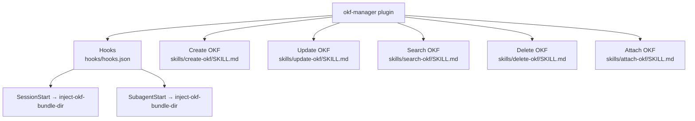

# OKF Manager `v1.1.2`

> A collection of skills for managing Open Knowledge Format (OKF) v0.2 bundles — create, update, search, delete, and attach concept documents to project directories.

## Prerequisites

- [VS Code](https://code.visualstudio.com/) with the [GitHub Copilot Chat](https://marketplace.visualstudio.com/items?itemName=GitHub.copilot-chat) extension installed and active.

## Installation

Install via the VS Code Chat Plugin Marketplace using the `dimpletz/prompts-collection` marketplace source and enable the **okf-manager** plugin.

## Environment Variables

| Variable | Required | Description |
|----------|----------|-------------|
| `OKF_DEFAULT_BUNDLE_DIR` | Optional | Default OKF bundle root directory. When set, all four skills treat it as the default for `bundle_directory`, making the parameter optional per invocation. |

## Usage

All capabilities are provided as **skills** — describe your OKF task in Copilot Chat and the appropriate skill is automatically invoked.

| Skill | Invoke when… |
|-------|--------------|
| **Create OKF** | You want to add a new concept document to an OKF bundle. |
| **Update OKF** | You want to modify the frontmatter fields or body of an existing OKF concept. |
| **Search OKF** | You want to find concepts in a bundle by type, tags, status, staleness, trust tier, or free-text query. |
| **Delete OKF** | You want to deprecate (default) or permanently remove a concept from a bundle. |
| **Attach OKF** | You want to hook an OKF bundle into a project directory by injecting a bundle-use instruction into the project's instruction file. |

## Hooks

| Hook | Trigger | Behaviour |
|------|---------|-----------|
| `SessionStart` | At the start of every chat session | Reads `OKF_DEFAULT_BUNDLE_DIR` and injects it into agent context when set. |
| `SubagentStart` | At the start of every sub-agent call | Same as `SessionStart`. |

## Components

### Create OKF

Creates a new OKF v0.2 concept document (`.md` file with YAML frontmatter) in a bundle directory. Composes the frontmatter from supplied fields, writes a body placeholder or verbatim body, optionally appends to the parent `index.md` (with confirmation), and appends a **Creation** entry to `log.md`.

### Update OKF

Reads an existing concept, merges supplied frontmatter field changes and/or body updates, refreshes `generated.at`, clears `verified` when content-bearing fields change, and writes the result back. Preserves all unknown frontmatter keys (§11). Appends an **Update** entry to `log.md`.

### Search OKF

Walks all non-reserved `.md` files in a bundle, parses their frontmatter, and returns a filtered results table. Supports filtering by `type`, `tags`, `status`, staleness (`stale_only`), and `trust_tier` (derived per OKF §5.3), plus free-text `query` against title, description, and body. Strictly read-only.

### Delete OKF

Marks a concept as deprecated (default) or physically removes it from the bundle. In `deprecate` mode, sets `status: deprecated` and optionally appends a reason note to the body. In `remove` mode, confirms with the user before deleting and cleans up the parent `index.md`. Both modes append an entry to `log.md`.

### Attach OKF

Hooks an OKF bundle into a project directory by injecting a bundle-use rule into the directory's AI instruction file (`AGENTS.md` → `CLAUDE.md` → creates `AGENTS.md` if neither exists). Idempotent: skips injection if the bundle path is already referenced. Append-only; never modifies or removes existing content.

## Author

[Dimpletz](https://github.com/dimpletz)
