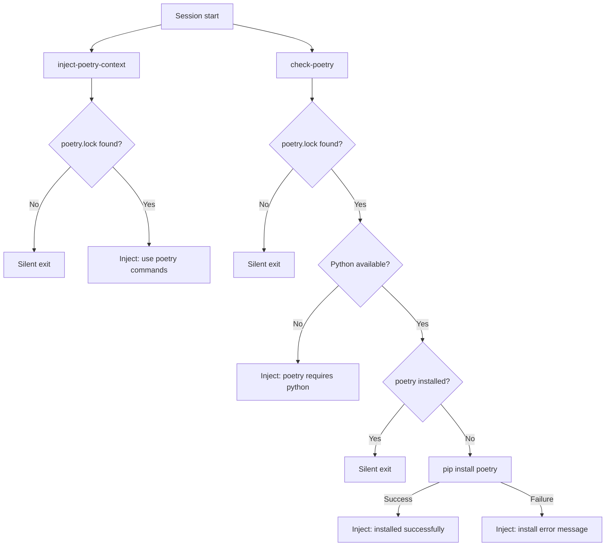

# poetry-user `v1.0.0`

> A plugin that detects whether the current workspace uses Poetry (via `poetry.lock`), injects context instructing the agent to prefer `poetry` commands, and automatically installs Poetry via pip if it is not already present.

## Installation

Install via the VS Code Chat Plugin Marketplace using the `dimpletz/prompts-collection` marketplace source and enable the **poetry-user** plugin.

## How It Works

### SessionStart hooks

Two scripts run at the start of every session:

1. **inject-poetry-context** — checks whether a `poetry.lock` file exists in the current workspace. If found, injects the following message into the agent context:

   > This project uses Poetry. Always use poetry commands as much as possible (e.g., `poetry run <cmd>`, `poetry add <package>`, `poetry install`, `poetry update`, `poetry remove <package>`).

   If `poetry.lock` is not found, the script exits silently and injects nothing.

2. **check-poetry** — runs only when `poetry.lock` is present. It:
   - Locates Python (`python` / `python3` / `py`). If Python is not found, injects:
     > poetry requires python. Python is not available on this system.
   - Checks whether `poetry` is already installed. If so, exits silently.
   - Attempts to install Poetry via `pip install poetry`. On success, injects:
     > Poetry was not installed and has been installed successfully via pip. You may need to restart the terminal for the 'poetry' command to be available in PATH.
   - On failure, injects:
     > Poetry is not installed and could not be installed via pip. Error: `<first 300 chars of pip output>`

## Skills

| Skill | Description |
|-------|-------------|
| [VS Code Poetry Configurator](skills/vscode-poetry-configurator/SKILL.md) | Configures VS Code to use the Poetry virtual environment as its Python interpreter and ensures all integrated PowerShell terminals automatically activate that environment. |

## Components

