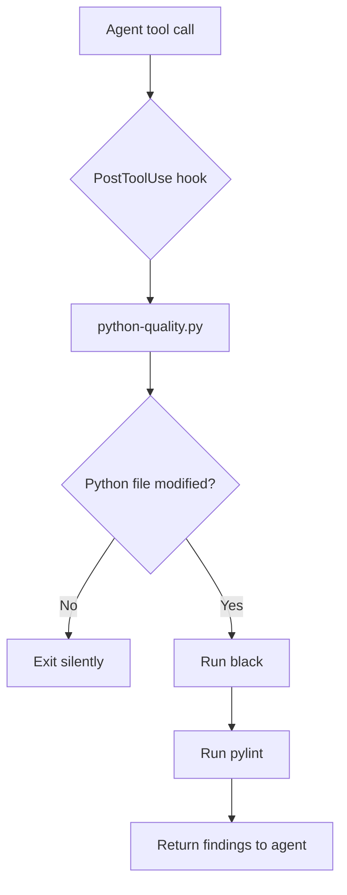

# python-developer `v1.1.0`

> A Claude plugin that enforces Python code quality by running `black` and `pylint` automatically after every Python file modification.

## Prerequisites

- **Python** — must be installed and available on the system `PATH`.  
  Verify with:
  ```bash
  python --version
  # or on some systems
  python3 --version
  ```
> `black` and `pylint` do **not** need to be installed manually — the hook installs them automatically when needed.

## Installation

Install via the VS Code Chat Plugin Marketplace using the `dimpletz/prompts-collection` marketplace source and enable the **python-developer** plugin.

## How It Works

The plugin registers a `PostToolUse` hook (`hooks/hooks.json`) that runs `scripts/python-quality.py` after every agent tool call.

When a Python file is created or modified the script:

1. Installs `black` and `pylint` automatically if they are not already present.
2. Runs `black` to auto-format the modified file(s).
3. Runs `pylint` on non-test Python file(s) and surfaces findings as additional context so the agent can iterate and fix issues.

## Components



## Author

[Dimpletz](https://github.com/dimpletz)
