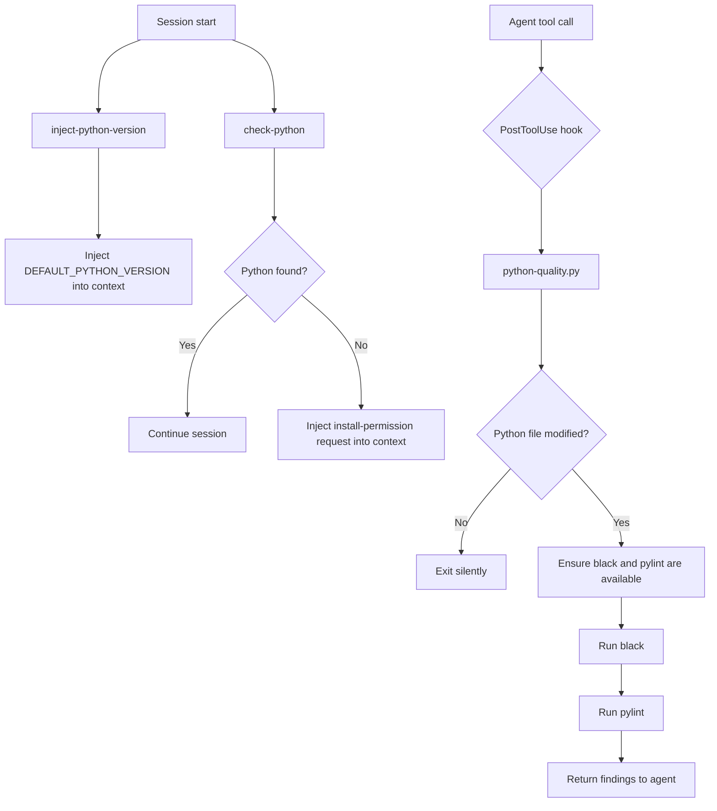

# python-developer `v1.2.0`

> A Claude plugin that enforces Python code quality by running `black` and `pylint` automatically after every Python file modification, injects `DEFAULT_PYTHON_VERSION` into the agent context at session start, and provides a skill to download and install Python from the official FTP server.

## Prerequisites

- **Python** — must be installed and available on the system `PATH`.  
  Verify with:
  ```bash
  python --version
  # or on some systems
  python3 --version
  ```
> `black` and `pylint` do **not** need to be installed manually — the hook installs them automatically when needed.

## Installation

Install via the VS Code Chat Plugin Marketplace using the `dimpletz/prompts-collection` marketplace source and enable the **python-developer** plugin.

## How It Works

### SessionStart hooks

Two scripts run at the start of every session:

1. **inject-python-version** — reads the `DEFAULT_PYTHON_VERSION` environment variable and injects it into the agent context as `DEFAULT_PYTHON_VERSION="<version>"`. Falls back to `3.14.4` if the variable is not set. This value is used by the `python-installer` skill without requiring the user to repeat it.

2. **check-python** — detects whether `python` or `python3` is available on `PATH`. If Python is **not** found, injects the following message into the agent context so the agent can act immediately:

   > Python is not installed on this system. Ask the user for permission to install Python using the python-installer skill. Do not proceed with the installation until the user explicitly grants permission. Once installation is complete, ask the user to restart the IDE or CLI for the changes to take effect.

### PostToolUse hook

The plugin registers a `PostToolUse` hook (`hooks/hooks.json`) that runs `scripts/python-quality.py` after every agent tool call.

When a Python file is created or modified the script:

1. Installs `black` and `pylint` automatically if they are not already present.
2. Runs `black` to auto-format the modified file(s).
3. Runs `pylint` on non-test Python file(s) and surfaces findings as additional context so the agent can iterate and fix issues.

## Components



## Skills

### python-installer

Downloads and silently installs a specific Python version from the official python.org FTP server.

- **Windows**: downloads `python-<version>-amd64.exe` and runs it with `/quiet PrependPath=1 InstallPip=1`.
- **macOS / Linux**: downloads `Python-<version>.tgz` and compiles from source via `make altinstall`.

The skill uses `DEFAULT_PYTHON_VERSION` from the agent context by default. See [skills/python-installer/SKILL.md](skills/python-installer/SKILL.md) for full usage details.

## Author

[Dimpletz](https://github.com/dimpletz)
