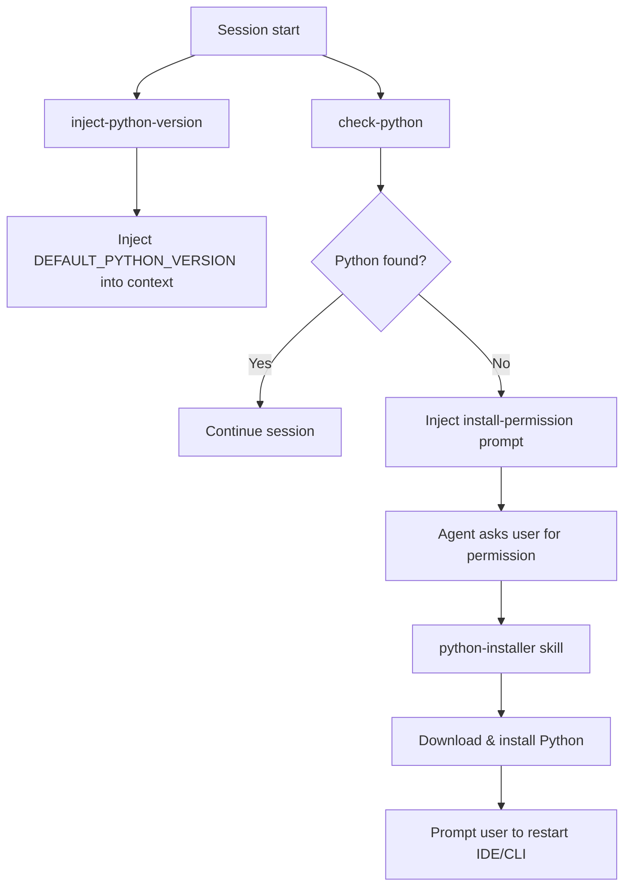

# python-user `v1.0.0`

> A plugin that injects `DEFAULT_PYTHON_VERSION` into the agent context at session start, checks whether Python is installed and prompts the agent to offer installation if missing, and provides a skill to download and install Python from the official FTP server.

## Installation

Install via the VS Code Chat Plugin Marketplace using the `dimpletz/prompts-collection` marketplace source and enable the **python-user** plugin.

## How It Works

### SessionStart hooks

Two scripts run at the start of every session:

1. **inject-python-version** — reads the `DEFAULT_PYTHON_VERSION` environment variable and injects it into the agent context as `DEFAULT_PYTHON_VERSION="<version>"`. Falls back to `3.14.4` if the variable is not set. This value is used by the `python-installer` skill without requiring the user to repeat it.

2. **check-python** — detects whether `python` or `python3` is available on `PATH`. If Python is **not** found, injects the following message into the agent context so the agent can act immediately:

   > Python is not installed on this system. Ask the user for permission to install Python using the python-installer skill. Do not proceed with the installation until the user explicitly grants permission. Once installation is complete, ask the user to restart the IDE or CLI for the changes to take effect.

## Skills

### Python Installer

Downloads and installs the official Python release for the current platform.

- **Windows**: runs `install-python.ps1` — downloads the `amd64` installer from `python.org/ftp` and installs silently with `PrependPath=1` and `InstallPip=1`.
- **macOS / Linux**: runs `install-python.sh` — downloads the source tarball, configures with `--enable-optimizations`, builds with `make`, and installs via `sudo make altinstall`.

The version to install defaults to `DEFAULT_PYTHON_VERSION` injected at session start. If neither the skill input nor the context variable is available, the agent asks the user before proceeding.

## Components

