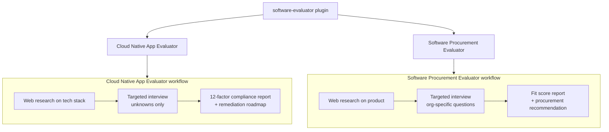

# Software Evaluator `v1.0.0`

> A collection of agents for evaluating cloud-native application readiness and software procurement decisions.

## Prerequisites

- [VS Code](https://code.visualstudio.com/) with the [GitHub Copilot Chat](https://marketplace.visualstudio.com/items?itemName=GitHub.copilot-chat) extension installed and active.
- Internet access is required — both agents use web research to gather context before asking questions.

## Installation

Install via the VS Code Chat Plugin Marketplace using the `dimpletz/prompts-collection` marketplace source and enable the **software-evaluator** plugin.

## Usage

Open Copilot Chat, select the desired agent, and provide the application or product you want evaluated.

| Agent | Invoke when… |
|-------|--------------|
| **Cloud Native App Evaluator** | You want to assess an application's 12-factor compliance and cloud-native readiness. |
| **Software Procurement Evaluator** | You want to evaluate an off-the-shelf software product for fit against your organization's needs. |

## Components

### Cloud Native App Evaluator

A research-first 12-factor compliance evaluator. Rather than presenting a generic checklist, it:

1. Uses web research to learn the user's tech stack, framework defaults, and deployment platform.
2. Determines which 12-factor concerns are already handled by the platform or framework.
3. Interviews the user only about application-specific unknowns.
4. Produces a context-specific compliance report with scores and an actionable remediation roadmap.

**Scope:** 12-factor App methodology evaluation only. Does not perform general code reviews or security audits.

### Software Procurement Evaluator

A research-first procurement fit evaluator based on ISO/IEC 25010. It:

1. Researches the off-the-shelf product (features, integrations, security certifications, pricing, vendor reputation) from public sources.
2. Asks the user only about organizational context (existing systems, workflows, scale, compliance requirements, budget).
3. Scores fit across 10 dimensions and produces a prioritized procurement recommendation report.

**Scope:** Off-the-shelf software evaluation only. Does not review custom-built source code or make final purchasing decisions.

## Author

[Dimpletz](https://github.com/dimpletz)
