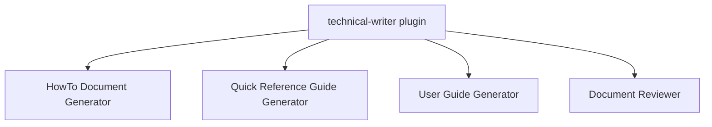

# Technical Writer `v1.1.0`

> A collection of agents for creating how-to guides, quick reference guides, user guides, and structured document reviews from any source material.

## Prerequisites

- [VS Code](https://code.visualstudio.com/) with the [GitHub Copilot Chat](https://marketplace.visualstudio.com/items?itemName=GitHub.copilot-chat) extension installed and active.

## Installation

Install via the VS Code Chat Plugin Marketplace using the `dimpletz/prompts-collection` marketplace source and enable the **technical-writer** plugin.

## Usage

Open Copilot Chat, select the desired agent, and provide the source material (links, files, code selections, or a description of the topic).

| Agent | Invoke when… |
|-------|--------------|
| **HowTo Document Generator** | You want a clear, step-by-step instructional guide for a task or process. |
| **Quick Reference Guide Generator** | You want a concise, scannable reference card for commands, APIs, configurations, or workflows. |
| **User Guide Generator** | You want a comprehensive guide written for non-technical users or business stakeholders. |
| **Document Reviewer** | You want a structured review of a document from a URL or attachment, covering observations, clarity, structure, concerns, recommendations, and an overall rating. |

## Hooks

| Event | Script | Description |
|-------|--------|-------------|
| `SessionStart` | [inject-doc-dir.ps1](scripts/inject-doc-dir.ps1) / [inject-doc-dir.sh](scripts/inject-doc-dir.sh) | Reads the `DOC_REVIEWER_DIR` environment variable and injects it into the agent context. If not set, the Document Reviewer agent falls back to `<workspace root>/doc-reviews/`. |

## Configuration

| Variable | Required | Description |
|----------|----------|-------------|
| `DOC_REVIEWER_DIR` | Optional | Absolute path to the directory where document review reports are saved. Supports any depth of nested subdirectories. If not set, reports are saved to `<workspace root>/doc-reviews/`. |

## Components

### HowTo Document Generator

Creates clear, comprehensive, step-by-step instructional guides from user-provided links, inputs, and attachments. Adapts content for technical and business audiences. Always presents a structured outline for review before generating the final document. Uses Mermaid diagrams, tables, and lists to produce detailed yet concise documentation.

**Best for:** Deployment procedures, configuration walkthroughs, developer onboarding guides, business process documentation.

### Quick Reference Guide Generator

Distills complex information from codebases, modules, folders, files, or code selections into concise, easy-to-scan reference materials. Ideal for command cheat sheets, API quick references, configuration summaries, and workflow overviews.

**Best for:** CLI command references, API endpoint summaries, keyboard shortcuts, configuration option tables.

### User Guide Generator

Translates complex technical functionality into simple, step-by-step instructions designed for non-technical users and business stakeholders. Includes visual aids, practical examples, and helpful tips. Analyzes codebases, UI components, and workflows to create guides that empower users to confidently use applications and systems.

**Best for:** End-user application manuals, business process guides, onboarding materials for non-technical staff.

### Document Reviewer

Accepts a document from a URL or an attached file and produces a comprehensive structured Markdown review report covering summary, observations (spelling, grammar, fact check, completeness), clarity and readability, structure and organization, concerns, priority-ranked recommendations, and an overall 1–5 rating per dimension. Reports are saved to `DOC_REVIEWER_DIR` or `<workspace root>/doc-reviews/`.

**Best for:** Reviewing technical specifications, design documents, user guides, blog posts, or any written artifact before publication or handoff.

## Author

[Dimpletz](https://github.com/dimpletz)
