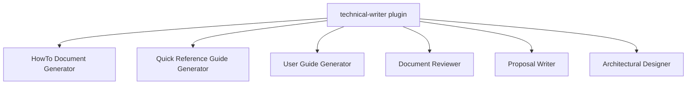

# Technical Writer `v1.2.0`

> A collection of agents for creating how-to guides, quick reference guides, user guides, structured document reviews, and professional proposals from any source material.

## Prerequisites

- [VS Code](https://code.visualstudio.com/) with the [GitHub Copilot Chat](https://marketplace.visualstudio.com/items?itemName=GitHub.copilot-chat) extension installed and active.

## Installation

Install via the VS Code Chat Plugin Marketplace using the `dimpletz/prompts-collection` marketplace source and enable the **technical-writer** plugin.

## Usage

Open Copilot Chat, select the desired agent, and provide the source material (links, files, code selections, or a description of the topic).

| Agent | Invoke when… |
|-------|--------------|
| **HowTo Document Generator** | You want a clear, step-by-step instructional guide for a task or process. |
| **Quick Reference Guide Generator** | You want a concise, scannable reference card for commands, APIs, configurations, or workflows. |
| **User Guide Generator** | You want a comprehensive guide written for non-technical users or business stakeholders. |
| **Document Reviewer** | You want a structured review of a document from a URL or attachment, covering observations, clarity, structure, concerns, recommendations, and an overall rating. |
| **Proposal Writer** | You want a professional proposal document synthesized from one or more sources (URLs, attached files, pasted text, or images), covering executive summary, background, scope, approach, timeline, roles, deliverables, budget, risks, benefits, and sign-off. |
| **Architectural Designer** | You want a comprehensive architectural design document synthesized from one or more sources, covering context, goals, architecture overview, design tradeoffs, component breakdown, security, scalability, quality attributes, low-level design, testing, and deployment, with Mermaid diagrams for every visualization. |

## Hooks

| Event | Script | Description |
|-------|--------|-------------|
| `SessionStart` | [inject-env-variables.ps1](scripts/inject-env-variables.ps1) / [inject-env-variables.sh](scripts/inject-env-variables.sh) | Reads the `DOC_REVIEWER_DIR`, `DOC_PROPOSAL_DIR`, and `DOC_ARCHITECTURE_DIR` environment variables and injects them into the agent context. If not set, agents fall back to `<workspace root>/doc-reviews/`, `<workspace root>/doc-proposals/`, and `<workspace root>/doc-architecture/` respectively. |

## Configuration

| Variable | Required | Description |
|----------|----------|-------------|
| `DOC_REVIEWER_DIR` | Optional | Absolute path to the directory where document review reports are saved. Supports any depth of nested subdirectories. If not set, reports are saved to `<workspace root>/doc-reviews/`. |
| `DOC_PROPOSAL_DIR` | Optional | Absolute path to the directory where proposal documents are saved. Supports any depth of nested subdirectories. If not set, proposals are saved to `<workspace root>/doc-proposals/`. |
| `DOC_ARCHITECTURE_DIR` | Optional | Absolute path to the directory where architectural design documents are saved. Supports any depth of nested subdirectories. If not set, documents are saved to `<workspace root>/doc-architecture/`. |

## Components

```mermaid
graph TD
    A[technical-writer plugin]
    A --> B[HowTo Document Generator]
    A --> C[Quick Reference Guide Generator]
    A --> D[User Guide Generator]
    A --> E[Document Reviewer]
    A --> F[Proposal Writer]
    A --> G[Architectural Designer]
```

### HowTo Document Generator

Creates clear, comprehensive, step-by-step instructional guides from user-provided links, inputs, and attachments. Adapts content for technical and business audiences. Always presents a structured outline for review before generating the final document. Uses Mermaid diagrams, tables, and lists to produce detailed yet concise documentation.

**Best for:** Deployment procedures, configuration walkthroughs, developer onboarding guides, business process documentation.

### Quick Reference Guide Generator

Distills complex information from codebases, modules, folders, files, or code selections into concise, easy-to-scan reference materials. Ideal for command cheat sheets, API quick references, configuration summaries, and workflow overviews.

**Best for:** CLI command references, API endpoint summaries, keyboard shortcuts, configuration option tables.

### User Guide Generator

Translates complex technical functionality into simple, step-by-step instructions designed for non-technical users and business stakeholders. Includes visual aids, practical examples, and helpful tips. Analyzes codebases, UI components, and workflows to create guides that empower users to confidently use applications and systems.

**Best for:** End-user application manuals, business process guides, onboarding materials for non-technical staff.

### Document Reviewer

Accepts a document from a URL or an attached file and produces a comprehensive structured Markdown review report covering summary, observations (spelling, grammar, fact check, completeness), clarity and readability, structure and organization, concerns, priority-ranked recommendations, and an overall 1–5 rating per dimension. Reports are saved to `DOC_REVIEWER_DIR` or `<workspace root>/doc-reviews/`.

**Best for:** Reviewing technical specifications, design documents, user guides, blog posts, or any written artifact before publication or handoff.

### Proposal Writer

Accepts one or more sources — URLs, attached files, pasted text, or images — and synthesizes them into a complete, professional Markdown proposal document. Follows a standard proposal template — title page, executive summary, background and objectives, scope of work, approach and methodology, timeline and milestones, roles and responsibilities, deliverables, budget, risks and mitigations, qualifications, terms and conditions, benefits, and acceptance sign-off. Includes a Mermaid mindmap in the overview section and additional diagrams (flowchart, Gantt) where they help clarify ideas. Proposals are saved to `DOC_PROPOSAL_DIR` or `<workspace root>/doc-proposals/`.

**Best for:** Creating project proposals, consulting bids, RFP responses, internal project approval requests, or any structured proposal derived from one or more source documents, notes, screenshots, or mixed inputs.

### Architectural Designer

Accepts one or more sources — URLs, attached files, pasted text, or images — and synthesizes them into a comprehensive, professional Markdown architectural design document following industry-standard practices (SEI, arc42). Covers context and background, goals and constraints, architecture overview with system context and component diagrams, design tradeoffs, per-component breakdown with data flow sequence diagrams, impact analysis, security considerations (auth, encryption, threat model), scalability and performance SLOs, quality attributes (reliability, observability, maintainability), low-level design (class diagram, ER diagram, API endpoints), testing strategy, and deployment procedures. Uses Mermaid diagrams for every visualization of concepts, flows, and relationships. Documents are saved to `DOC_ARCHITECTURE_DIR` or `<workspace root>/doc-architecture/`.

**Best for:** Designing and documenting new systems or major features, creating technical blueprints for development teams, capturing architectural decisions and tradeoffs, or producing Architecture Decision Records (ADRs) and Software Architecture Documents (SADs) from requirements, PRDs, or discovery notes.

## Author

[Dimpletz](https://github.com/dimpletz)
